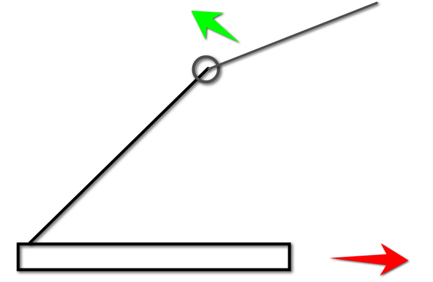

# 2023CompeitionRobot

## Project Structure

- auto: Autonomous routines.
- controlboard: Read inputs and outputs from the driver and the operator.
- coordinators: Codes for overall coordination.
- motion: Kinematics, inverse kinematics, and constraints of superstructure.
- shuffleboard: Displaying and logging.
- states: The states of Superstructure, Scoring, and the whole Robot.
- subsystems: All the small functional components on the robot.

## Positive Direcitions

1. **Counter-Clockwise (CCW)** is taken as the positive direction - unless explicitly stated.
2. Pointing the right thumb to the positive direction, the direction of the rest of the fingers when they are curled up naturally is the positive direction of the angle. (Right hand rule)
3. The direction of the inclined tower is the positive direciton. The arrows shown on the picture indicates the positive direction of drivetrain and arm.

