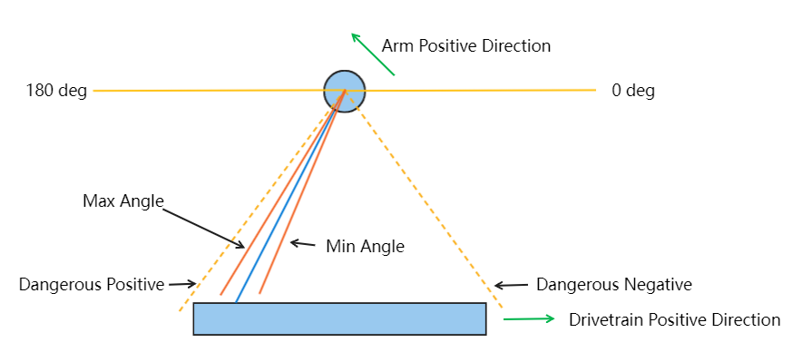

# 2023CompeitionRobot

## Positive Direcitions

1. **Counter-Clockwise (CCW)** is taken as the positive direction - unless explicitly stated.
2. Pointing the right thumb to the positive direction, the direction of the rest ofthe fingers is the positive direction of the angle. (Right hand rule)
3. The direction of the inclined tower is the positive direciton. Shown on the picture.

